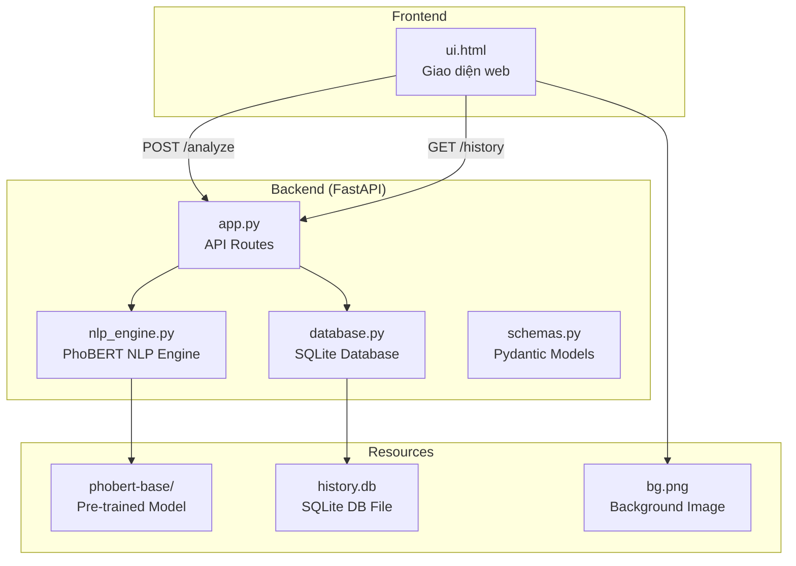
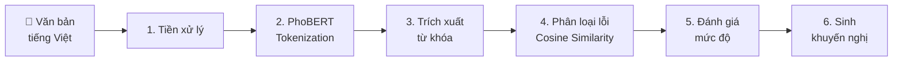
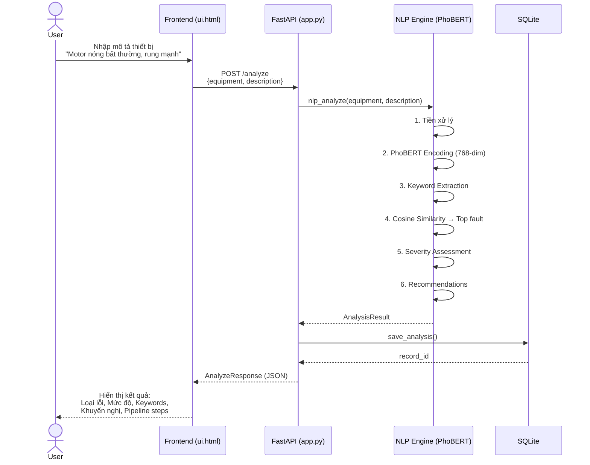

# 📋 Tổng Hợp Project: NLP Equipment Fault Analysis System

## 1. Mô tả tổng quan

Đây là hệ thống **phân tích cảnh báo lỗi thiết bị công nghiệp** sử dụng **NLP (Natural Language Processing)** với model **PhoBERT** (`vinai/phobert-base`). Hệ thống nhận đầu vào là **mô tả bằng ngôn ngữ tiếng Việt** về tình trạng thiết bị, sau đó tự động phân loại lỗi, đánh giá mức độ nghiêm trọng, và đưa ra khuyến nghị xử lý.

---

## 2. Kiến trúc hệ thống



## 3. Cấu trúc thư mục

```
nlp/
├── main.py                          # Entry point — Uvicorn server (port 10805)
├── test_e2e.py                      # E2E tests (10 test cases)
│
├── backend/
│   ├── app.py                       # FastAPI app + API routes
│   ├── core/
│   │   └── nlp_engine.py            # ⭐ NLP Engine (PhoBERT) — 659 dòng
│   ├── database/
│   │   └── database.py              # SQLite CRUD operations
│   ├── model/
│   │   └── schemas.py               # Pydantic request/response models
│   ├── resources/
│   │   ├── phobert-base/            # PhoBERT model files
│   │   └── database/history.db      # SQLite database
│   └── test/
│       ├── test_engine.py           # Unit tests cho NLP Engine
│       └── test_phase2.py           # Integration tests
│
└── frontend/
    ├── templates/
    │   └── ui.html                  # Single-page web UI (1276 dòng)
    └── images/
        └── bg.png                   # Background image
```

## 4. Nguyên lý hoạt động — NLP Pipeline

Hệ thống hoạt động theo quy trình **6 bước** (pipeline):



### Bước 1️⃣ — Tiền xử lý văn bản
- Normalize Unicode (NFC)
- Chuyển lowercase
- Loại bỏ ký tự đặc biệt, giữ lại tiếng Việt có dấu
- Chuẩn hóa khoảng trắng

### Bước 2️⃣ — PhoBERT Tokenization & Encoding
- Tokenize text bằng PhoBERT tokenizer
- Encode thành **embedding vector 768 chiều** sử dụng `[CLS]` token từ last hidden state
- Model chạy ở chế độ **inference** (CPU mode)

### Bước 3️⃣ — Trích xuất từ khóa (Keyword Extraction)
- So khớp văn bản với **SYMPTOM_KEYWORDS** database (8 nhóm: Nhiệt độ, Rung động, Âm thanh, Mùi, Điện, Rò rỉ, Cơ khí, Hiệu suất)
- Xử lý **negation** (phủ định): nhận biết "không nóng", "không rung" → loại bỏ keyword bị phủ định
- Tránh overlap giữa các keyword

### Bước 4️⃣ — Phân loại lỗi bằng PhoBERT (Semantic Classification)
Đây là **bước cốt lõi** của hệ thống:

1. **Pre-compute**: Khi khởi tạo, engine tính trước embeddings cho **10 loại lỗi** tham chiếu (mỗi loại có 5-15 câu mẫu)
2. **Cosine Similarity**: So sánh embedding của text input với embedding trung bình của mỗi loại lỗi
3. **Keyword-aware Re-ranking**: Boost score các loại lỗi liên quan đến keyword đã phát hiện (+0.1/category)
4. **Decision Logic**: Nếu top result là "Bình thường" hoặc không có keyword → "Hoạt động ổn định"

| Loại lỗi | Severity Base |
|---|---|
| Bình thường | 0.0 |
| Rò rỉ hệ thống | 0.5 |
| Âm thanh bất thường | 0.5 |
| Giảm hiệu suất | 0.55 |
| Hư hỏng cơ khí | 0.6 |
| Quá nhiệt | 0.7 |
| Hỏng bạc đạn / vòng bi | 0.75 |
| Quá tải cơ khí | 0.8 |
| Sự cố điện | 0.85 |
| Cháy cuộn dây / cháy motor | 0.9 |

### Bước 5️⃣ — Đánh giá mức độ nghiêm trọng (Severity Assessment)
Công thức: `severity_score = severity_base × similarity + keyword_bonus`
- `keyword_bonus = min(số_keyword × 0.05, 0.2)`

| Score | Mức độ |
|---|---|
| ≥ 0.65 | 🔴 **NGHIÊM TRỌNG** |
| ≥ 0.40 | 🟡 **CẢNH BÁO** |
| < 0.40 | 🟢 **THẤP** |

### Bước 6️⃣ — Sinh khuyến nghị
- Tra cứu `RECOMMENDATIONS_DB` theo loại lỗi đã phân loại
- Mỗi loại lỗi có 4-6 khuyến nghị xử lý cụ thể

---

## 5. API Endpoints

| Method | Path | Mô tả |
|---|---|---|
| `GET` | `/` | Serve giao diện web |
| `POST` | `/analyze` | Phân tích NLP (equipment + description) |
| `GET` | `/history` | Lấy lịch sử phân tích (phân trang) |
| `GET` | `/history/{id}` | Chi tiết 1 bản ghi |
| `DELETE` | `/history/{id}` | Xóa 1 bản ghi |
| `DELETE` | `/history` | Xóa toàn bộ lịch sử |

---

## 6. Stack công nghệ

| Thành phần | Công nghệ |
|---|---|
| NLP Model | **PhoBERT** (vinai/phobert-base) — HuggingFace Transformers |
| Backend | **FastAPI** + Uvicorn |
| Database | **SQLite** |
| Frontend | **HTML/CSS/JS** (Single-page) |
| ML Framework | **PyTorch** (CPU mode) |
| Validation | **Pydantic** v2 |

---

## 7. Luồng xử lý chính (Use Case)



## 8. Đặc điểm nổi bật

- **Xử lý ngôn ngữ tự nhiên tiếng Việt**: Sử dụng PhoBERT — model pre-trained dành riêng cho tiếng Việt
- **Semantic matching**: Không chỉ so khớp keyword mà hiểu ngữ nghĩa câu văn
- **Negation handling**: Nhận biết phủ định ("không nóng" ≠ "nóng")
- **Keyword-aware re-ranking**: Kết hợp semantic (PhoBERT) + rule-based (keyword) để tăng độ chính xác
- **Transparency**: Hiển thị chi tiết từng bước pipeline cho user
- **Lưu lịch sử**: Mọi kết quả phân tích đều được lưu vào SQLite để tra cứu lại
