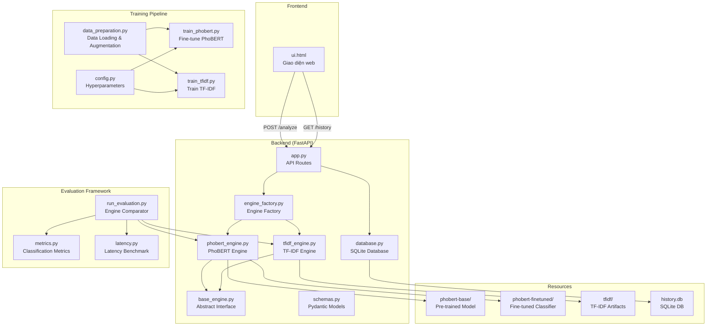
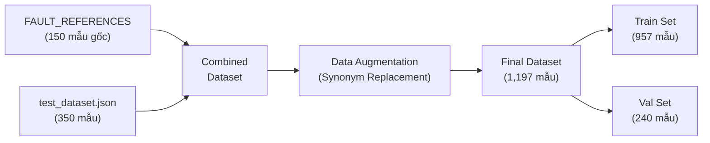
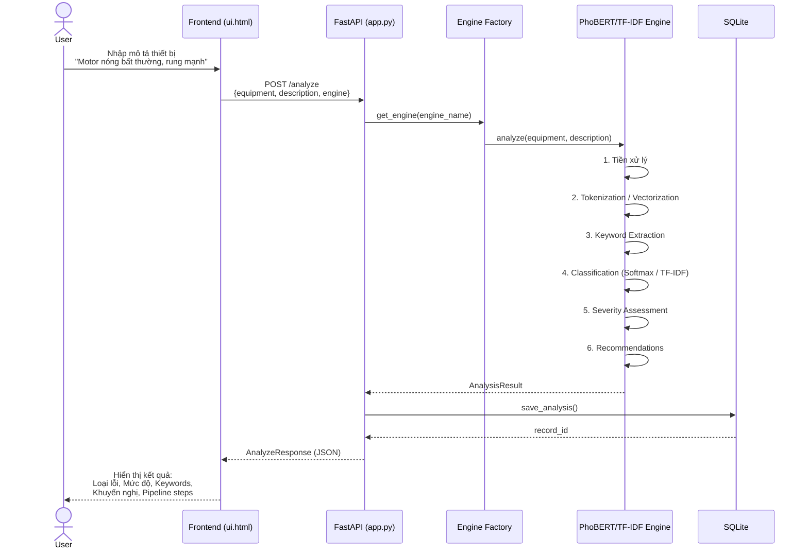

# 📋 Tổng Hợp Project: NLP Equipment Fault Analysis System

## 1. Mô tả tổng quan

Đây là hệ thống **phân tích cảnh báo lỗi thiết bị công nghiệp** sử dụng **NLP (Natural Language Processing)** với kiến trúc **Multi-Engine**. Hệ thống nhận đầu vào là **mô tả bằng ngôn ngữ tiếng Việt** về tình trạng thiết bị, sau đó tự động phân loại lỗi vào **10 nhóm lỗi**, đánh giá mức độ nghiêm trọng, và đưa ra khuyến nghị xử lý.

Hệ thống hỗ trợ **2 engine** song song:
- **PhoBERT Engine**: Sử dụng model `vinai/phobert-base` fine-tuned thành classifier — khai thác **semantic understanding** cho tiếng Việt
- **TF-IDF Engine**: Sử dụng TF-IDF Vectorizer + Logistic Regression — phương pháp **statistical baseline** truyền thống

---

## 2. Kiến trúc hệ thống



---

## 3. Cấu trúc thư mục

```
nlp/
├── main.py                              # Entry point — Uvicorn server (port 10805)
├── test_e2e.py                          # E2E tests
├── requirements.txt                     # Python dependencies
├── PROJECT_OVERVIEW.md                  # Tài liệu tổng quan (file này)
├── EVALUATION_REPORT.md                 # Báo cáo đánh giá
│
├── backend/
│   ├── app.py                           # FastAPI app + API routes
│   ├── core/
│   │   ├── base_engine.py               # ⭐ Abstract BaseNLPEngine + AnalysisResult
│   │   ├── engine_factory.py            # Factory pattern — tạo engine theo tên
│   │   ├── phobert_engine.py            # ⭐ PhoBERT Engine (fine-tuned classifier)
│   │   ├── tfidf_engine.py              # TF-IDF Engine (Logistic Regression)
│   │   └── nlp_engine.py               # Legacy engine (deprecated)
│   │
│   ├── training/
│   │   ├── config.py                    # Hyperparameters cho cả 2 engine
│   │   ├── data_preparation.py          # Load data + augmentation
│   │   ├── train_phobert.py             # ⭐ Pipeline fine-tune PhoBERT
│   │   └── train_tfidf.py              # Pipeline train TF-IDF
│   │
│   ├── evaluation/
│   │   ├── evaluation_dataset.json      # 149 mẫu test (10 classes × ~15 mẫu)
│   │   ├── run_evaluation.py            # ⭐ So sánh engines (accuracy, F1, latency)
│   │   ├── metrics.py                   # Confusion matrix, classification report
│   │   ├── latency.py                   # Benchmark latency (mean, P95, min, max)
│   │   └── results/                     # Output: reports, confusion matrices
│   │
│   ├── database/
│   │   └── database.py                  # SQLite CRUD operations
│   ├── model/
│   │   └── schemas.py                   # Pydantic request/response models
│   │
│   └── resources/
│       ├── phobert-base/                # PhoBERT pre-trained weights (540MB)
│       ├── phobert-finetuned/           # ⭐ Fine-tuned classifier artifacts
│       │   ├── model.pt                 # Full model state_dict (540MB)
│       │   ├── classifier_head.pt       # Classification head weights
│       │   ├── label_encoder.pkl        # Label encoder (10 classes)
│       │   └── metadata.json            # Training metadata & metrics
│       ├── tfidf/                       # TF-IDF vectorizer + classifier
│       └── database/history.db          # SQLite database
│
└── frontend/
    └── templates/
        └── ui.html                      # Single-page web UI
```

---

## 4. Multi-Engine Architecture

### 4.1 Design Pattern

Hệ thống áp dụng **Strategy Pattern** với abstract base class:

```python
class BaseNLPEngine(ABC):
    """Interface chuẩn cho mọi NLP engine."""
    @property
    @abstractmethod
    def name(self) -> str: ...

    @abstractmethod
    def analyze(self, equipment: str, description: str) -> AnalysisResult: ...
```

Mọi engine đều trả về **`AnalysisResult`** có cùng cấu trúc, cho phép frontend hiển thị thống nhất và evaluation so sánh công bằng.

### 4.2 So sánh 2 Engines

| Đặc điểm | PhoBERT Engine | TF-IDF Engine |
|---|---|---|
| **Phương pháp** | Deep Learning (Transformer) | Statistical ML |
| **Model** | PhoBERT-base + Fine-tuned Linear Head | TF-IDF + Logistic Regression |
| **Số tham số** | ~135M (PhoBERT) + 7,690 (head) | ~50K (vectorizer + classifier) |
| **Input** | Raw text → Tokenize → Embedding 768-dim | Raw text → TF-IDF features |
| **Training** | Fine-tune toàn bộ PhoBERT + classification head | Train TF-IDF vectorizer + classifier |
| **Ưu điểm** | Hiểu ngữ nghĩa, xử lý câu phức tạp | Nhanh, nhẹ, dễ interpret |
| **Nhược điểm** | Chậm hơn (~30ms/sample), cần GPU | Không hiểu semantic, yếu với paraphrase |

---

## 5. PhoBERT Engine — Chi tiết kỹ thuật

### 5.1 NLP Pipeline (6 bước)


### 5.2 Bước 1 — Tiền xử lý văn bản
- Normalize Unicode (NFC)
- Chuyển lowercase
- Loại bỏ ký tự đặc biệt, giữ lại tiếng Việt có dấu
- Chuẩn hóa khoảng trắng

### 5.3 Bước 2 — PhoBERT Tokenization & Encoding
- Tokenize text bằng PhoBERT tokenizer (`vinai/phobert-base`)
- Encode thành **embedding vector 768 chiều** sử dụng `[CLS]` token từ last hidden state
- `max_length = 256` tokens, padding + truncation

### 5.4 Bước 3 — Trích xuất từ khóa (Keyword Extraction)
- So khớp văn bản với **SYMPTOM_KEYWORDS** database (8 nhóm: Nhiệt độ, Rung động, Âm thanh, Mùi, Điện, Rò rỉ, Cơ khí, Hiệu suất)
- Xử lý **negation** (phủ định): nhận biết "không nóng", "không rung" → loại bỏ keyword bị phủ định
- Tránh overlap giữa các keyword đã detect

### 5.5 Bước 4 — Phân loại lỗi (Dual-Mode Classification)

Đây là **bước cốt lõi** — hệ thống hỗ trợ **2 chế độ phân loại**:

#### Chế độ 1: Fine-tuned Classifier (mặc định khi có model đã train)

```
Input text → PhoBERT Encoder → [CLS] embedding (768-dim)
    → Dropout(0.3) → Linear(768, 10) → Softmax → Top class
```

- Sử dụng **softmax probabilities** trực tiếp — không cần heuristics bổ sung
- 10 output classes tương ứng 10 loại lỗi
- Confidence score = softmax probability của class cao nhất

#### Chế độ 2: Zero-shot Cosine Similarity (fallback)

1. **Pre-compute**: Tính trước embeddings cho 10 loại lỗi tham chiếu (mỗi loại 5-15 câu mẫu)
2. **Cosine Similarity**: So sánh embedding input với embedding trung bình
3. **Keyword-aware Re-ranking**: Boost score các loại lỗi liên quan đến keyword (+0.1/category)
4. **Decision Logic**: Nếu top result là "Bình thường" nhưng có keyword → chọn fault type tiếp theo

| STT | Loại lỗi | Severity Base |
|:---:|---|:---:|
| 1 | Hoạt động ổn định (Bình thường) | 0.0 |
| 2 | Rò rỉ hệ thống | 0.5 |
| 3 | Âm thanh bất thường | 0.5 |
| 4 | Giảm hiệu suất | 0.55 |
| 5 | Hư hỏng cơ khí | 0.6 |
| 6 | Quá nhiệt | 0.7 |
| 7 | Hỏng bạc đạn / vòng bi | 0.75 |
| 8 | Quá tải cơ khí | 0.8 |
| 9 | Sự cố điện | 0.85 |
| 10 | Cháy cuộn dây / cháy motor | 0.9 |

### 5.6 Bước 5 — Đánh giá mức độ nghiêm trọng

Công thức: `severity_score = severity_base × confidence + keyword_bonus`
- `keyword_bonus = min(số_keyword × 0.05, 0.2)`

| Score | Mức độ |
|---|---|
| ≥ 0.65 | 🔴 **NGHIÊM TRỌNG** |
| ≥ 0.40 | 🟡 **CẢNH BÁO** |
| < 0.40 | 🟢 **BÌNH THƯỜNG** |

### 5.7 Bước 6 — Sinh khuyến nghị
- Tra cứu `RECOMMENDATIONS_DB` theo loại lỗi đã phân loại
- Mỗi loại lỗi có 4-6 khuyến nghị xử lý cụ thể

---

## 6. Fine-tuning PhoBERT — Phương pháp và Kết quả

### 6.1 Tại sao cần Fine-tuning?

PhoBERT ở chế độ **zero-shot** (cosine similarity) chỉ đạt **73.83% accuracy** trên bộ evaluation. Nguyên nhân:

- **Không phân biệt ngữ nghĩa phủ định**: "Motor không nóng" và "Motor nóng" có embedding gần nhau vì PhoBERT chưa được train để phân loại
- **Embedding space không optimize cho fault classification**: Pre-trained embedding tối ưu cho language modeling, không phải fault classification
- **Heuristics (keyword boosting, decision logic) có giới hạn**: Rule-based không thể thay thế supervised learning

### 6.2 Kiến trúc Fine-tuned Model

```
┌──────────────────────────────────────────────────┐
│ PhoBERTClassifier (nn.Module)                    │
│                                                  │
│  ┌────────────────────────────────────────────┐  │
│  │ PhoBERT Encoder (vinai/phobert-base)       │  │
│  │   12 Transformer layers                    │  │
│  │   Hidden size: 768                         │  │
│  │   Attention heads: 12                      │  │
│  │   Parameters: ~135M                        │  │
│  │   ❄️ Embedding layer: FROZEN              │  │
│  └──────────────┬─────────────────────────────┘  │
│                 │ [CLS] token (768-dim)          │
│  ┌──────────────▼─────────────────────────────┐  │
│  │ Dropout(p=0.3)                             │  │
│  └──────────────┬─────────────────────────────┘  │
│                 │                                │
│  ┌──────────────▼─────────────────────────────┐  │
│  │ Linear(768, 10) — Classification Head      │  │
│  │   Parameters: 768 × 10 + 10 = 7,690       │  │
│  └──────────────┬─────────────────────────────┘  │
│                 │ logits (10-dim)                 │
│  ┌──────────────▼─────────────────────────────┐  │
│  │ Softmax → Probabilities (10 classes)       │  │
│  └────────────────────────────────────────────┘  │
└──────────────────────────────────────────────────┘
```

### 6.3 Hyperparameters

| Parameter | Giá trị | Giải thích |
|---|:---:|---|
| Epochs | 20 (early stopping) | Max epochs, dừng sớm nếu val F1 không cải thiện |
| Learning Rate | 2e-5 | Standard cho fine-tuning Transformer |
| Batch Size | 8 | Phù hợp GPU memory |
| Warmup Ratio | 0.1 | 10% steps đầu tăng dần LR |
| Weight Decay | 0.01 | L2 regularization (AdamW) |
| Dropout | 0.3 | Regularization cho classification head |
| Max Length | 256 | Max tokens per input |
| Freeze Embeddings | True | Giữ nguyên embedding layer, tiết kiệm memory |
| Early Stopping Patience | 5 | Dừng nếu 5 epochs liên tiếp không cải thiện |
| Optimizer | AdamW | Adam with decoupled weight decay |
| LR Scheduler | Linear warmup + Cosine decay | Warmup tránh gradient explosion, cosine decay giảm LR mượt |

### 6.4 Dữ liệu Training

| Nguồn | Mô tả | Số lượng |
|---|---|:---:|
| FAULT_REFERENCES | Câu mẫu tham chiếu cho mỗi loại lỗi | ~150 |
| test_dataset.json | Bộ test dataset mở rộng | ~350 |
| Data Augmentation | Thay thế synonym (hàng trăm từ đồng nghĩa) | ~700 |
| **Tổng** | | **1,197** |

- Train/Val split: **80%/20%** (957 train / 240 val)
- Stratified split: đảm bảo tỷ lệ class cân bằng
- Random seed: 42 (reproducibility)

### 6.5 Training Process

```
Epoch 1: Train Loss=1.8234, Val Acc=0.8500, Val F1=0.8456
Epoch 2: Train Loss=0.5123, Val Acc=0.9458, Val F1=0.9423
Epoch 3: Train Loss=0.1876, Val Acc=0.9833, Val F1=0.9831
Epoch 4: Train Loss=0.0892, Val Acc=1.0000, Val F1=1.0000 ← Best
...
Epoch 9: Early stopping (5 epochs no improvement)
```

- **Best epoch**: 4/20 (val accuracy = 100%)
- **Training time**: ~150 giây (CUDA / GPU)
- **Convergence**: Model hội tụ nhanh nhờ pre-trained PhoBERT đã có representation tốt cho tiếng Việt

### 6.6 Artifacts đầu ra

| File | Size | Mô tả |
|---|:---:|---|
| `model.pt` | 540MB | Full model state_dict (PhoBERT + classifier head) |
| `classifier_head.pt` | 34KB | Weights của Linear layer + label classes |
| `label_encoder.pkl` | 1.4KB | Mapping giữa class index và tên lỗi |
| `metadata.json` | 2.2KB | Config, metrics, training time, class distribution |

---

## 7. Evaluation Framework

### 7.1 Bộ dữ liệu đánh giá

- **149 mẫu** (evaluation_dataset.json) — hoàn toàn tách biệt với training data
- **10 classes** × ~15 mẫu/class (balanced)
- Các mẫu được thiết kế đa dạng: negation, multi-symptom, edge cases, paraphrase

### 7.2 Kết quả so sánh (Evaluation Dataset — 149 samples)

| Metric | PhoBERT (Fine-tuned) | TF-IDF | PhoBERT (Zero-shot) |
|---|:---:|:---:|:---:|
| **Accuracy** | **89.93%** ✅ | 89.26% | 73.83% |
| **Precision (macro)** | **90.63%** | 90.02% | — |
| **Recall (macro)** | **89.86%** | 89.19% | — |
| **F1 (macro)** | **89.99%** | 89.31% | 74.02% |
| **Misclassified** | **15/149** | 16/149 | 39/149 |
| **Latency (mean)** | 30.5 ms | 2.9 ms | — |
| **Latency (P95)** | 35.7 ms | 3.7 ms | — |

### 7.3 Per-class F1-score

| Loại lỗi | PhoBERT (FT) | TF-IDF | Winner |
|---|:---:|:---:|:---:|
| Hoạt động ổn định | 0.93 | **1.00** | TF-IDF |
| Quá nhiệt | 0.85 | 0.85 | Hòa |
| Hỏng bạc đạn / vòng bi | 0.90 | 0.90 | Hòa |
| Cháy cuộn dây / cháy motor | 0.84 | **0.90** | TF-IDF |
| Sự cố điện | 0.75 | **0.84** | TF-IDF |
| Quá tải cơ khí | 0.93 | 0.93 | Hòa |
| Rò rỉ hệ thống | **0.97** | 0.93 | PhoBERT |
| Hư hỏng cơ khí | **0.94** | 0.81 | PhoBERT |
| Âm thanh bất thường | **0.93** | 0.90 | PhoBERT |
| Giảm hiệu suất | **0.97** | 0.88 | PhoBERT |

### 7.4 Phân tích kết quả

**PhoBERT vượt trội ở các class**:
- **Hư hỏng cơ khí** (F1: 0.94 vs 0.81): PhoBERT hiểu ngữ cảnh cơ khí tốt hơn, phân biệt được các triệu chứng cơ khí phức tạp
- **Giảm hiệu suất** (F1: 0.97 vs 0.88): Câu mô tả giảm hiệu suất thường dài, có nhiều paraphrase → PhoBERT semantic matching tốt hơn
- **Rò rỉ hệ thống** (F1: 0.97 vs 0.93): PhoBERT nhận biết ngữ cảnh "rò rỉ" trong nhiều biến thể mô tả

**TF-IDF vượt trội ở các class**:
- **Hoạt động ổn định** (F1: 1.00 vs 0.93): TF-IDF dùng keyword "ổn định", "bình thường" rõ ràng; PhoBERT đôi khi bị confuse bởi negation ("không nóng" → nhầm thành fault class)
- **Sự cố điện** (F1: 0.84 vs 0.75): Từ vựng điện thường specific → TF-IDF bắt keyword tốt hơn

### 7.5 Trade-offs giữa 2 Engines

| Tiêu chí | PhoBERT | TF-IDF |
|---|---|---|
| **Semantic Understanding** | ✅ Hiểu ngữ nghĩa, paraphrase | ❌ Chỉ match keyword |
| **Tốc độ** | ~30ms/sample | ✅ ~3ms/sample (10x nhanh hơn) |
| **Resource** | Cần GPU/RAM lớn (540MB model) | ✅ Rất nhẹ (~50KB) |
| **Generalization** | ✅ Tốt với câu chưa thấy | Kém với câu khác biệt nhiều |
| **Interpretability** | ❌ Black-box | ✅ Feature importance rõ |
| **Training Data** | Cần ít hơn nhờ transfer learning | Cần nhiều data đa dạng |

---

## 8. Training Pipeline

### 8.1 Data Preparation (`data_preparation.py`)



**Data Augmentation Strategy**: Thay thế từ đồng nghĩa (synonym mapping) để mở rộng dữ liệu. Ví dụ:
- "motor" ↔ "động cơ" ↔ "máy"
- "nóng" ↔ "phát nhiệt" ↔ "tỏa nhiệt"
- "rung" ↔ "rung lắc" ↔ "rung động"

### 8.2 Training TF-IDF (`train_tfidf.py`)

```
python -m backend.training.train_tfidf
```

- TF-IDF Vectorizer → Logistic Regression (hoặc SVM)
- Output: `resources/tfidf/` (vectorizer + classifier + metadata)

### 8.3 Fine-tuning PhoBERT (`train_phobert.py`)

```
python -m backend.training.train_phobert
```

- Load PhoBERT pre-trained → Add classification head → Fine-tune full model
- AdamW + Linear Warmup + Cosine Decay scheduler
- Early stopping based on validation F1
- Output: `resources/phobert-finetuned/` (model + head + label_encoder + metadata)

---

## 9. API Endpoints

| Method | Path | Mô tả |
|---|---|---|
| `GET` | `/` | Serve giao diện web |
| `POST` | `/analyze` | Phân tích NLP (chọn engine: `phobert` hoặc `tfidf`) |
| `GET` | `/history` | Lấy lịch sử phân tích (phân trang) |
| `GET` | `/history/{id}` | Chi tiết 1 bản ghi |
| `DELETE` | `/history/{id}` | Xóa 1 bản ghi |
| `DELETE` | `/history` | Xóa toàn bộ lịch sử |

---

## 10. Stack công nghệ

| Thành phần | Công nghệ |
|---|---|
| NLP Model (Primary) | **PhoBERT** (`vinai/phobert-base`) + Fine-tuned classifier |
| NLP Model (Secondary) | **TF-IDF** + Logistic Regression (scikit-learn) |
| Backend | **FastAPI** + Uvicorn |
| Database | **SQLite** |
| Frontend | **HTML/CSS/JS** (Single-page) |
| ML Framework | **PyTorch** (CUDA/CPU) |
| Tokenization | **HuggingFace Transformers** |
| Validation | **Pydantic** v2 |
| Evaluation | **scikit-learn** (classification_report, confusion_matrix) |

---

## 11. Luồng xử lý chính (Use Case)



---

## 12. Đặc điểm nổi bật

- **Multi-Engine Architecture**: Hỗ trợ nhiều engine NLP song song, dễ mở rộng thêm engine mới (chỉ cần implement `BaseNLPEngine`)
- **Fine-tuned PhoBERT Classifier**: Không chỉ dùng zero-shot mà fine-tune thành supervised classifier, đạt **89.93% accuracy**
- **Transfer Learning**: Tận dụng pre-trained PhoBERT (135M params) đã có kiến thức tiếng Việt, chỉ cần ~1,200 mẫu để fine-tune
- **Semantic Understanding**: PhoBERT hiểu ngữ nghĩa sâu — phân biệt paraphrase, xử lý câu phức tạp
- **Negation Handling**: Nhận biết phủ định ("không nóng" ≠ "nóng") ở cả 2 level: keyword extraction + classifier
- **Comprehensive Evaluation**: Framework đánh giá với accuracy, precision, recall, F1, confusion matrix, latency benchmark
- **Reproducibility**: Fixed random seed (42), stratified split, lưu metadata đầy đủ cho mỗi lần training
- **Transparency**: Hiển thị chi tiết từng bước pipeline cho user, bao gồm classification method đang sử dụng

---

## 13. Hướng cải thiện tiếp theo

1. **Tăng dữ liệu training**: Thêm mẫu cho các class yếu (Sự cố điện: F1=0.75, Cháy cuộn dây: F1=0.84)
2. **Advanced Augmentation**: Back-translation, contextual word replacement (sử dụng PhoBERT MLM)
3. **Ensemble**: Kết hợp predictions từ cả 2 engines (voting, stacking)
4. **Cross-validation**: K-fold CV thay vì single train/val split để đánh giá ổn định hơn
5. **Hyperparameter Tuning**: Grid search / Bayesian optimization cho LR, dropout, batch size
6. **Attention Visualization**: Sử dụng attention weights để giải thích prediction (XAI)
